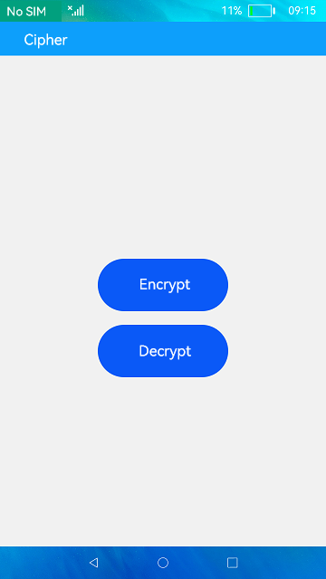
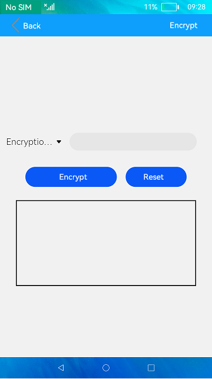
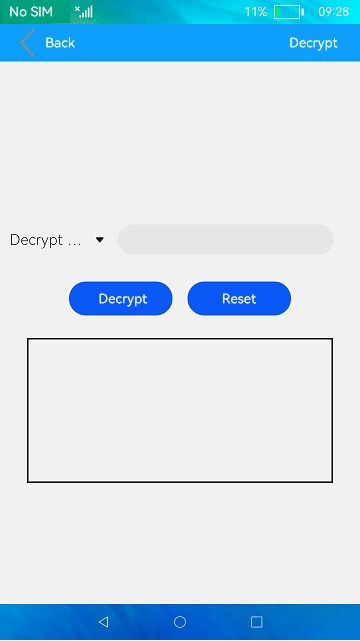

# Cipher

### Introduction

This sample shows how to use cipher algorithms, including Rivest-Shamir-Adleman (RSA) and Advanced Encryption Standard (AES). The display effect is as follows:

  

### Concepts

RSA: A public-key cryptosystem that works on two different keys: a public encryption key and a private decryption key.

AES: A block encryption standard established by the U.S. National Institute of Standards and technology (NIST). It is also called Rijndael.

### Required Permissions

N/A.

### Usage

1. On the home screen, touch the **Encrypt** button. On the **Encrypt** screen, select an encryption algorithm from the **Encryption Algorithm** drop-down list box, enter the content to be encrypted in the text box, and touch the **Encrypt** button.

   The encrypted content is displayed in the text box below.

2. Touch the **Reset** button to clear the content in the text box.

3. Touch the **Decrypt** button on the home screen. On the **Decrypt** screen, select a decryption algorithm from the **Decryption Algorithm** drop-down list box, enter the content to be decrypted in the text box, and touch the **Decrypt** button.

   The decrypted content is displayed in the text box below.

4. Touch the **Reset** button to clear the content in the text box.

### Constraints

- This sample can only be run on standard-system devices.

- This sample requires DevEco Studio 3.1 Canary1 (Build Version: 3.1.0.100) to compile and run.
