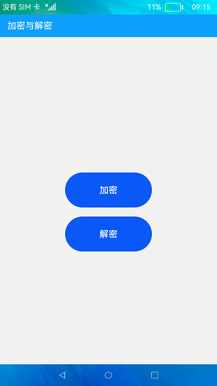
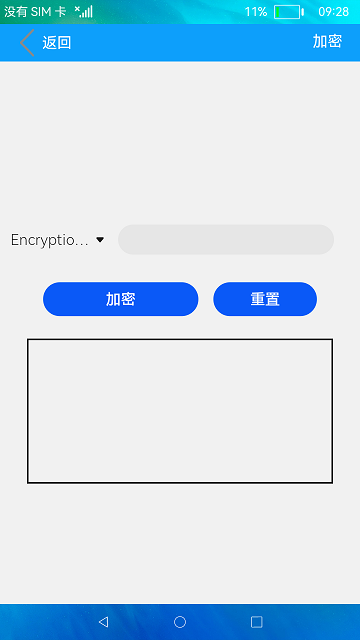
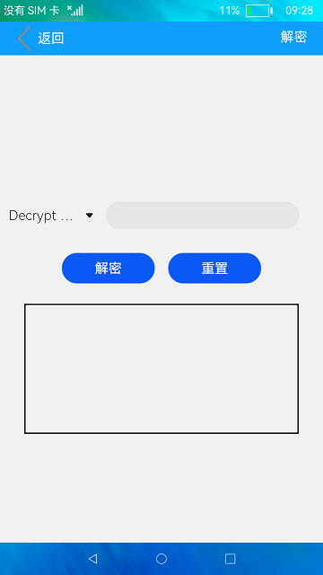

# 加解密

### 介绍

本示例使用[cipher](https://developer.harmonyos.com/cn/docs/documentation/doc-references-V3/js-apis-system-cipher-0000001427745048-V3#ZH-CN_TOPIC_0000001427745048__cipherrsa)相关接口实现了字符串加解密算法，包括RSA加密算法与AES加密算法。

RSA加密算法：RSA公开密钥密码体制是一种使用不同的加密密钥与解密密钥，由已知加密密钥推导出解密密钥在计算上是不可行的密码体制。

AES加密算法：AES密码学中的高级加密标准，又称Rijndael加密法，是美国联邦政府采用的一种区块加密标准。

使用说明

1.点击主页面的**加密**按钮，在加密界面中点击**Encryption Algorithm**下拉选择加密算法，在输入框中输入待加密的内容，点击**加密**
按钮，下方文本框中显示加密后内容。

2.点击**重置**按钮，清除文本框中内容。

3.点击主页面的**解密**按钮，在解密界面中点击**Decrypt Algorithm**下拉选择解密算法，在输入框中输入待解密的内容，点击**解密**
按钮，下方文本框中显示解密后内容。

4.点击**重置**按钮，清除文本框中内容。

### 效果预览

|主页|加密页面|解密页面|
|--------------------------------|--------------------------------|--------------------------------|
||  ||

### 相关权限

不涉及。

### 依赖

不涉及。

### 约束与限制

1. 本示例仅支持在标准系统上运行，支持设备：华为手机或者运行在DevEco Studio上的华为手机模拟器。
2. 本示例为Stage模型，从API version 9开始支持。
3. 本示例需要使用DevEco Studio 3.1 Beta2 (Build Version：3.1.0.400)才可编译运行。

