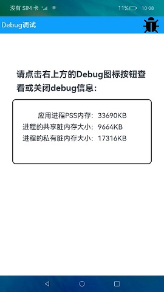

# HiDebug

### Introduction

This sample shows how to use HiDebug APIs to obtain the memory usage of an application. The display effect is as follows:

 

### Concepts

**HiDebug**: a module that allows you to obtain the memory usage of an application, including the static heap memory (native heap) and proportional set size (PSS) occupied by the application process. It also allows you to export VM memory slices and collect VM CPU profiling data.

**Stack**: a component that provides a stack container where child components are successively stacked and the latter one overwrites the previous one.

**@Builder**: a decorator used for a method to define the declarative UI description of a component and quickly generate multiple layouts in a custom component.

### Required Permissions

N/A

### Usage

1. Touch the **Debug** icon in the upper right corner of the page. The debugging information page is displayed, showing the memory usage of the application.

2. Touch the **Debug** icon again. The debugging information page disappears.

### Constraints

1. This sample can only be run on standard-system devices.

2. This sample is based on the stage model, which is supported from API version 9.

3. DevEco Studio 3.1 Canary1 (Build Version: 3.1.0.100) must be used.
