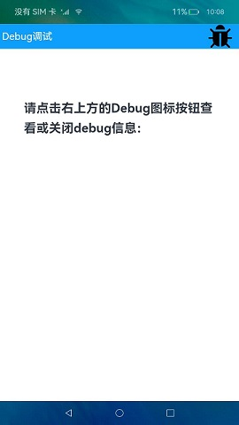

# Debug

### 介绍

本示例通过使用[@ohos.hidebug](https://developer.harmonyos.com/cn/docs/documentation/doc-references-V3/js-apis-hidebug-0000001427902712-V3) 接口来获取当前应用内存使用情况。

### 效果预览

|主页|Debug数据|
|--------------------------------|--------------------------------|
|||

使用说明

1.点击界面右上方Debug图标，弹出Debug信息界面，显示当前应用内存使用情况；

2.再次点击右上方Debug图标，Debug信息界面消失。

### 工程目录

```
entry/src/main/ets/
|---component
|   |---DebugInfo.ets                  // Debug信息页面
|---data
|   |---Logger.ts                      // 日志工具
|---MainAbility
|---pages
|   |---Index.ets                      // 首页
```
### 具体实现

* 本实例获取Debug信息的功能结主要封装在Index，源码参考:[Index.ets](entry/src/main/ets/pages/Index.ets) 。
    * 获取Debug信息：在Index页面中通过点击事件调用hidebug.getPss()、hidebug.getSharedDirty()、hidebug.getPrivateDirty()等方法能够获取应用进程实际使用的物理内存大小、进程的共享脏内存大小、进程的私有脏内存大小。

### 相关权限

不涉及。

### 依赖

不涉及。

### 约束与限制

1. 本示例仅支持在标准系统上运行，支持设备：华为手机或者运行在DevEco Studio上的华为手机模拟器。
2. 本示例为Stage模型，从API version 9开始支持。
3. 本示例需要使用DevEco Studio 3.1 Beta2 (Build Version：3.1.0.400)才可编译运行。