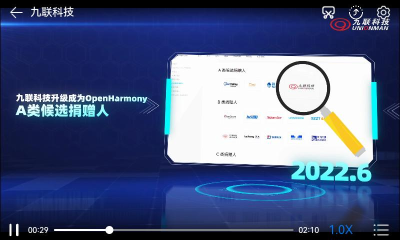
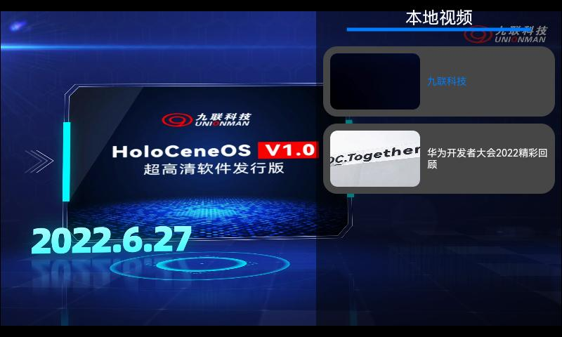
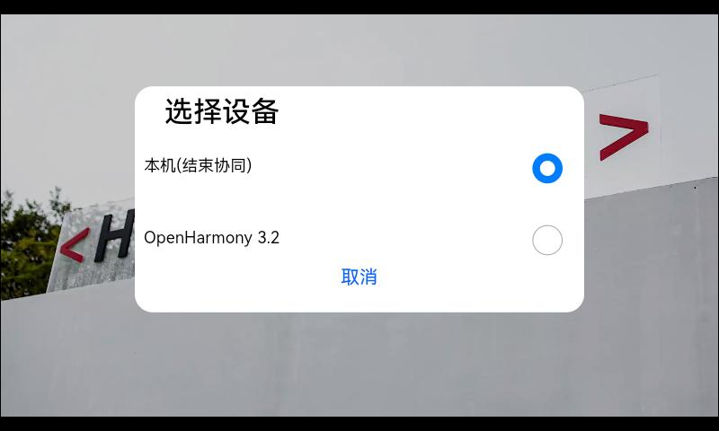
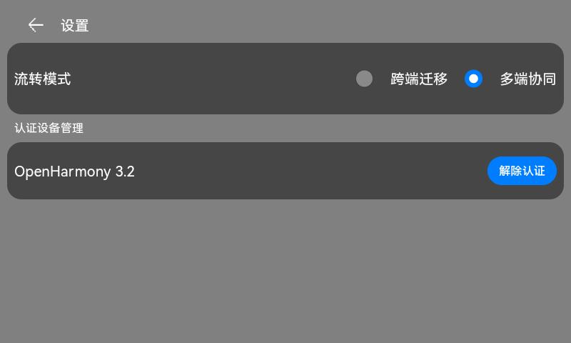

# 分布式视频播放器

### 介绍

本示例使用medialibrary获取本地视频文件资源，并通过AVPlayer完成了视频的播放、暂停、跳转、倍速等功能；并使用DeviceManager完成了分布式设备列表的显示和分布式能力完成了视频播放状态的跨设备协同。

本示例用到了文件存储管理能力接口[@ohos.fileio](https://gitee.com/openharmony/docs/blob/master/zh-cn/application-dev/reference/apis/js-apis-fileio.md)

媒体查询接口[@ohos.mediaquery](https://gitee.com/openharmony/docs/blob/master/zh-cn/application-dev/reference/apis/js-apis-mediaquery.md)

分布式键值数据库接口[@ohos.data.distributedKVStore](https://gitee.com/openharmony/docs/blob/master/zh-cn/application-dev/reference/apis/js-apis-distributed-data.md)

音视频相关媒体业务能力接口[@ohos.multimedia.media](https://gitee.com/openharmony/docs/blob/master/zh-cn/application-dev/reference/apis/js-apis-media.md)

分布式设备管理能力接口(设备管理)，实现设备之间的kvStore对象的数据传输交互[@ohos.distributedHardware.deviceManager](https://gitee.com/openharmony/docs/blob/master/zh-cn/application-dev/reference/apis/js-apis-device-manager.md)

应用持久化轻量级数据接口[@ohos.data.preferences](https://gitee.com/openharmony/docs/blob/master/zh-cn/application-dev/reference/apis/js-apis-data-preferences.md)

屏幕截图接口[@ohos.screenshot](https://gitee.com/openharmony/docs/blob/master/zh-cn/application-dev/reference/apis/js-apis-screenshot.md)

### 效果预览

| 首页                                  | 视频列表                           |
| ------------------------------------- | ---------------------------------- |
|         |  |
| **设备弹窗**                          | **设置**                           |
|  |      |

使用说明

1. 首次进入应用会弹出权限弹窗，需要进行授权；
1. 播放视频源可使用hdc命令将视频推到storage/media/100/local/files/Videos路径下并重启；
1. **单击**播放键/暂停键或**双击**界面控制**播放/暂停**；
2. 点击进度条或左右滑动**操控进度**；
3. 点击右上角流转按钮，即可弹出设备选择框；
3. 在设备选择框中点击对端设备名称，拉起对端应用；
3. 对端应用启动后，可在任意一端中操作应用，两端应用可实现数据实时同步；
3. 在设备选择框中选中本机即可关闭对端应用；
3. 点击右上角设置按钮，可对流转模式及分布式认证设备进行设置管理；

### 工程目录

```
entry/src/main/ets/
|---pages
|   |---Index.ets                           // 首页
|   |---Settings.ets                        // 设置页
|---model
|   |---DistributedDataModel.ts             // 封装分布式数据类
|   |---Logger.ets                          // 日志工具
|   |---KvStoreModel.ets                    // kvstore对象操作类
|   |---RemoteDeviceModel.ets               // 远程设备操作类
|---common
|   |---BasicDataSource.ets                 // 懒加载数据
|   |---DeviceDialog.ets                    // 分布式设备列表弹窗
|   |---ScreenshotDialog.ets                // 屏幕截图弹窗
|   |---TitleBar.ets                        // 菜单栏模块(包含远端设备拉起)
|---utils
|   |---AVPlayerUtils.ts                    // 封装AVPlayer工具类
|   |---DateTimeUtil.ets                    // 日期时间工具类
|   |---MediaUtils.ts                       // 媒体库工具类
|   |---utils.ets                           // 自定义工具类
```

### 具体实现

在分布式视频播放器应用中，分布式设备管理包含了分布式设备搜索、分布式设备列表弹窗、远端设备拉起三部分。
首先在分布式组网内搜索设备，然后把设备展示到分布式设备列表弹窗中，最后根据用户的选择拉起远端设备。

#### 分布式设备搜索

通过SUBSCRIBE_ID搜索分布式组网内的远端设备，详见startDeviceDiscovery(){}模块[源码参考](https://gitee.com/openharmony/vendor_unionman/blob/master/unionpi_tiger/sample/app/DistributedVideoPlayer/entry/src/main/ets/model/RemoteDeviceModel.ets)。

#### 分布式设备列表弹窗

使用@CustomDialog装饰器来装饰分布式设备列表弹窗，[源码参考](https://gitee.com/openharmony/vendor_unionman/blob/master/unionpi_tiger/sample/app/DistributedVideoPlayer/entry/src/main/ets/common/DeviceDialog.ets)。

#### 远端设备拉起

通过startAbility(deviceId)方法拉起远端设备的包，[源码参考](https://gitee.com/openharmony/vendor_unionman/blob/master/unionpi_tiger/sample/app/DistributedVideoPlayer/entry/src/main/ets/common/TitleBar.ets)。

#### 分布式数据管理

(1) 管理分布式数据库
创建一个KVManager对象实例，用于管理分布式数据库对象。通过distributedKVStore.createKVManager(config)，并通过指定Options和storeId，创建并获取KVStore数据库，并通过Promise方式返回，此方法为异步方法，例如this.kvManager.getKVStore(STORE_ID, options).then((store) => {})

(2) 订阅分布式数据变化
通过订阅分布式数据库所有（本地及远端）数据变化实现数据协同[源码参考](https://gitee.com/openharmony/vendor_unionman/blob/master/unionpi_tiger/sample/app/DistributedVideoPlayer/entry/src/main/ets/model/KvStoreModel.ets)。

### 相关权限

[ohos.permission.DISTRIBUTED_DATASYNC](https://gitee.com/openharmony/docs/blob/master/zh-cn/application-dev/security/permission-list.md#ohospermissiondistributed_datasync)

[ohos.permission.CAPTURE_SCREEN](https://gitee.com/openharmony/docs/blob/master/zh-cn/application-dev/security/permission-list.md#ohospermissioncapture_screen)

[ohos.permission.READ_MEDIA](https://gitee.com/openharmony/docs/blob/master/zh-cn/application-dev/security/permission-list.md#ohospermissionread_media)

[ohos.permission.WRITE_MEDIA](https://gitee.com/openharmony/docs/blob/master/zh-cn/application-dev/security/permission-list.md#ohospermissionwrite_media)

### 依赖

不涉及。

### 约束与限制

1. 本示例仅支持标准系统上运行；
2. 本示例仅支持API9版本SDK，SDK版本号(API Version 9 Release)，镜像版本号(3.2 Release)；
3. 本示例需要使用DevEco Studio 版本号(3.1 Release)才可编译运行；
4. 本示例涉及使用系统接口：@ohos.distributedHardware.deviceManager，需要手动替换Full SDK才能编译通过，具体操作可参考[替换指南](https://gitee.com/openharmony/docs/blob/master/zh-cn/application-dev/faqs/full-sdk-switch-guide.md)；
5. 本示例涉及系统接口，需要配置系统应用签名，可以参考[特殊权限配置方法](https://gitee.com/openharmony/docs/blob/master/zh-cn/application-dev/security/app-provision-structure.md#修改harmonyappprovision配置文件)，把配置文件中的“app-feature”字段信息改为“hos_system_app”。

### 下载

如需单独下载本工程，执行如下命令：

```
git init
git config core.sparsecheckout true
echo unionpi_tiger/sample/app/DistributedVideoPlayer/ > .git/info/sparse-checkout
git remote add origin https://gitee.com/openharmony/vendor_unionman.git
git pull origin master
```