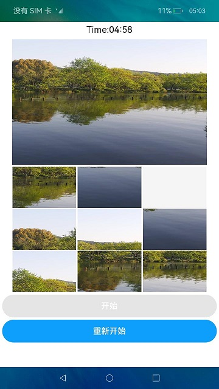

# Puzzle Game

### Introduction

This example uses the [@ohos.multimedia.image](https://developer.harmonyos.com/cn/docs/documentation/doc-references-V3/js-apis-image-0000001477981401-V3) and [@ohos.multimedia.mediaLibrary](https://developer.harmonyos.com/cn/docs/documentation/doc-references-V3/js-apis-medialibrary-0000001478061921-V3) interfaces to obtain images and perform image cropping and segmentation functions.

### Effect Preview
|home page| run                                        |
|---|--------------------------------------------|
||  |

Instructions for use：
1. After taking photos with the preset camera, start the application. The application homepage will read the image file inside the device and display the first image obtained. If there are no images, the image position will be blank；
2. After clicking Start, the countdown will begin. If the puzzle is not completed within the specified time, the game will end. In the game, players click Restart to reset the game；
3. After clicking to start the game, players can move around the gray grid images based on the large image above. After clicking, the images and gray grids exchange positions, and finally assemble a complete image；
4. When not in the game, players can click on the large image above and choose a custom image to play the puzzle game。

### project directory
```
VideoComponent/src/main/ets/components
|---common
|   |---ImagePicker.ets                     // Picture selection
|---model
|   |---GameRules.ts                        // Game Rules
|   |---ImageModel.ts                       // Image operation
|   |---Logger.ts                           // log
|   |---PictureItem.ts                      // Decomposed images
|---pages
|   |---Index.ets                           // home page
```

### Specific implementation
+ The effect of image cropping and segmentation in the game is implemented in ImageModel，source code reference [ImageModel](entry/src/main/ets/model/ImageModel.ts):
    + Get local images：First, use getMediaLibrary to obtain a media library instance，then use the getFileAssets method to obtain file resources，finally, use getAllObject to retrieve all the file assets in the search results for easy display；
    + Crop Image Preparation：Cropping images requires the use of [@ohos.multimedia.image](https://developer.harmonyos.com/cn/docs/documentation/doc-references-V3/js-apis-image-0000001477981401-V3) interface，before cropping, you need to apply for image editing permission，using [requestPermissionsFromUser](https://developer.harmonyos.com/cn/docs/documentation/doc-references-V3/js-apis-abilityaccessctrl-0000001478341361-V3#ZH-CN_TOPIC_0000001478341361__requestpermissionsfromuser9)
      apply for，source code reference [Index.ets](entry/src/main/ets/pages/Index.ets);
    + Image editing：First, use createImagePacker to create an ImagePacker instance，then use fileAsset. open to open the file，calling the createImageSource interface to create an image source instance facilitates image manipulation，next, use the getImageInfo method to obtain the image size for easy segmentation，finally, use the createPixelMap method to pass in the size parameters of each copy to complete image cropping。

### Required Permissions

[ohos.permission.READ_MEDIA](https://developer.harmonyos.com/cn/docs/documentation/doc-guides/permission-list-0000001281480750)

[ohos.permission.MEDIA_LOCATION](https://developer.harmonyos.com/cn/docs/documentation/doc-guides/permission-list-0000001281480750)

### Dependency

N/A

### Constraints

1. This sample only supports running on standard systems and supports devices such as Huawei phones or Huawei phone emulators running on DevEco Studio.

2. This sample is the Stage model, which is supported starting from API version 9.

3. DevEco Studio 3.1 Beta2 (Build Version：3.1.0.400) must be used.
