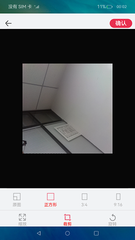

# Image Processing

### Introduction

This sample demonstrates the image processing function.

In this sample, [\<TextArea>](https://gitee.com/openharmony/docs/blob/master/en/application-dev/reference/arkui-ts/ts-basic-components-textarea.md) is used to implement multi-line text input, [mediaLibrary](https://gitee.com/openharmony/docs/blob/master/en/application-dev/reference/apis/js-apis-mediaquery.md) is used to obtain images from albums, [image](https://gitee.com/openharmony/docs/blob/master/en/application-dev/reference/apis/js-apis-image.md) is used to generate pixel maps, and **scale()**, **crop()**, and **rotate()** of the **pixelMap** class are used to scale, crop, and rotate images.

### Effect Preview
|Picture Zoom|Picture clipping|Pictures rotating                      |
|-----|-----|---------------------------------------|
|||  |

### Usage

1. Touch **Add image** on the offering review page. The page for selecting images is displayed.

2. Select the images to be displayed. You can select six images at most.

3. Select an image and touch **Next**. The image editing page is displayed. To scale an image, touch **scale** and then touch **narrow** or **amplification**. To crop the image, touch **crop** and select a crop ratio. To rotate the image, touch **rotate**.

4. After finishing editing the image, touch **OK**. The page for posting comments is displayed, with the images shown. You can touch **Add image** to add more images.

5. Touch the back button to exit the app.

### project directory
```
entry/src/main/ets/
|---pages
|   |---ChoicePhotos.ets                    // Picture selection
|   |---EditPages.ets                       // Image editing
|   |---Index.ets                           // Home Page
photomodify/src/main/ets/components
|---pages
|   |---ChoicePhoto.ets                     // Picture selection
|   |---EditPage.ets                        // Image editing
|---util                                  
|   |---Logger.ts                           // Logging tool
```
### Specific implementation
+ Image selection function implemented in ChoicePhoto，source code reference [ChoicePhoto.ets](photomodify/src/main/ets/components/pages/ChoicePhoto.ets):
    + Picture selection：First, use getMediaLibrary to obtain a media library instance，then use getFileAssets to obtain the resource file set，then use getAllObject to retrieve all file assets in the file retrieval results，display on the page for easy selection，after selecting, jump to image editing and transfer the uri of the target image；
+ Image editing function implemented in EditPage，source code reference [EditPage.ets](photomodify/src/main/ets/components/pages/EditPage.ets):
    + Image editing：Image editing permission requires the use of [requestPermissionsFromUser](https://developer.harmonyos.com/cn/docs/documentation/doc-references-V3/js-apis-abilityaccessctrl-0000001478341361-V3#ZH-CN_TOPIC_0000001478341361__requestpermissionsfromuser9) apply for，source code reference [MainAbility.ts](entry/src/main/ets/MainAbility/MainAbility.ts)，first, open the image file based on the uri obtained from the selected image，select 'rw' read and write mode for fileAsset. open,then use image.createImageSource to create an image source instance,next, use createPixelMap to create a PixelMap object,easy to process images, and finally use crop to crop the images,use scale to scale the image and rotate it for rotation processing.

### Required Permissions

[ohos.permission.READ_MEDIA](https://developer.harmonyos.com/cn/docs/documentation/doc-guides/permission-list-0000001281480750)

[ohos.permission.WRITE_MEDIA](https://developer.harmonyos.com/cn/docs/documentation/doc-guides/permission-list-0000001281480750)

[ohos.permission.MEDIA_LOCATION](https://developer.harmonyos.com/cn/docs/documentation/doc-guides/permission-list-0000001281480750)

### Dependency

N/A

### Constraints

1. This sample only supports running on standard systems and supports devices such as Huawei phones or Huawei phone emulators running on DevEco Studio.

2. This sample is the Stage model, which is supported starting from API version 9.

3. DevEco Studio 3.1 Beta2 (Build Version：3.1.0.400) must be used.
