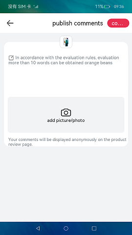
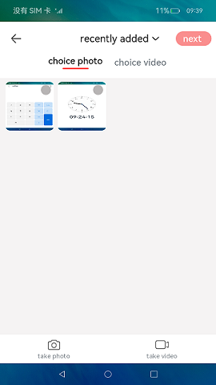
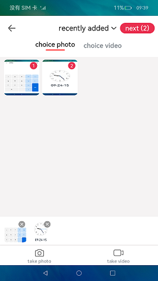
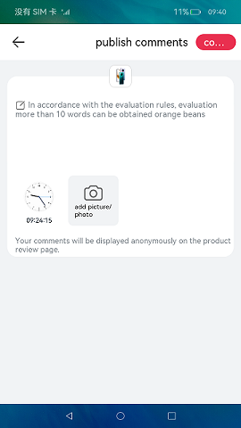

# Image Show

### Introduction

In this sample, you can add images from **Gallery** to the offering review page.

This sample uses the [**\<TextArea>**](https://gitee.com/openharmony/docs/blob/master/en/application-dev/reference/arkui-ts/ts-basic-components-textarea.md) component to implement multi-line text input and the [mediaLibrary](https://gitee.com/openharmony/docs/blob/master/en/application-dev/reference/apis/js-apis-mediaquery.md) class to obtain and select images.

### Usage

1. Touch **Add image**. The page for selecting images is displayed.

2. Select the images to be added. The number of selected images is displayed in the upper right corner, and the thumbnails of selected images are displayed in the lower part. You can select six images at most.

3. Touch **Next**. The home page is displayed, and the images selected are displayed on the home page. You can touch **Add image** again to select other images.

4. Touch the text box to input your comment.

5. Touch the back button to exit the app.

### Display Effect

   

### Project Directory
```
entry/src/main/ets/                 
|---MainAbility
|   |---MainAbility.ts                    
|---pages
|   |---Index.ets                      // HomePage
|   |---ChoicePhoto.ets                // Select Image/Photo 
|   |---utils.ts
```

### Specific implementation
* This sample is divided into three modules：
    * Publish evaluation page module：
        * Develop and publish evaluation pages using components such as scroll, TextArea, Grid, etc
        * Source code link：[Index.ets](entry/src/main/ets/pages/Index.ets)
        * Reference interface：[@ohos.router](https://gitee.com/openharmony/docs/blob/master/zh-cn/application-dev/reference/apis/js-apis-router.md)

    * Select Image/Photo Module
        * Call the ChoicePhotos method in the dependency to open the album, and mediaquery media to query the album,GetMediaLibrary retrieves instances of the media library, accesses personal media data information such as users, and selects images
        * Source code link：[ChoicePhotos.ets](imagelibrary/src/main/ets/components/pages/ChoicePhotos.ets)，[MainAbility.ts](entry/src/main/ets/MainAbility/MainAbility.ts)
        * Reference interface：[@ohos.router](https://gitee.com/openharmony/docs/blob/master/zh-cn/application-dev/reference/apis/js-apis-router.md)，[@ohos.promptAction](https://gitee.com/openharmony/docs/blob/master/zh-cn/application-dev/reference/apis/js-apis-promptAction.md)，[@ohos.mediaquery](https://gitee.com/openharmony/docs/blob/master/zh-cn/application-dev/reference/apis/js-apis-system-mediaquery.md)，[@ohos.multimedia.mediaLibrary](https://gitee.com/openharmony/docs/blob/master/zh-cn/application-dev/reference/apis/js-apis-medialibrary.md)，[@ohos.abilityAccessCtrl](https://gitee.com/openharmony/docs/blob/master/zh-cn/application-dev/reference/apis/js-apis-abilityAccessCtrl.md)

    * Submit module
        * Select the image and click the Next button to return to the post evaluation page. Click the Submit button to submit
        * Source code link：[Index.ets](entry/src/main/ets/pages/Index.ets)
        * Reference interface：[@ohos.router](https://gitee.com/openharmony/docs/blob/master/zh-cn/application-dev/reference/apis/js-apis-router.md)

### Required Permissions

[ohos.permission.READ_MEDIA](https://gitee.com/openharmony/docs/blob/master/en/application-dev/security/permission-list.md)

### Dependency

N/A

### Constraints

1. This sample only supports running on standard systems and supports devices such as Huawei phones or Huawei phone emulators running on DevEco Studio.

2. This sample is the Stage model, which is supported starting from API version 9.

3. This sample requires DevEco Studio 3.1 Beta2 (Build Version: 3.1.0.400) and above to compile and run.
