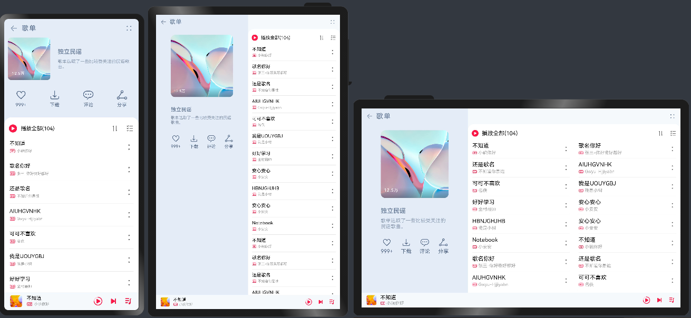
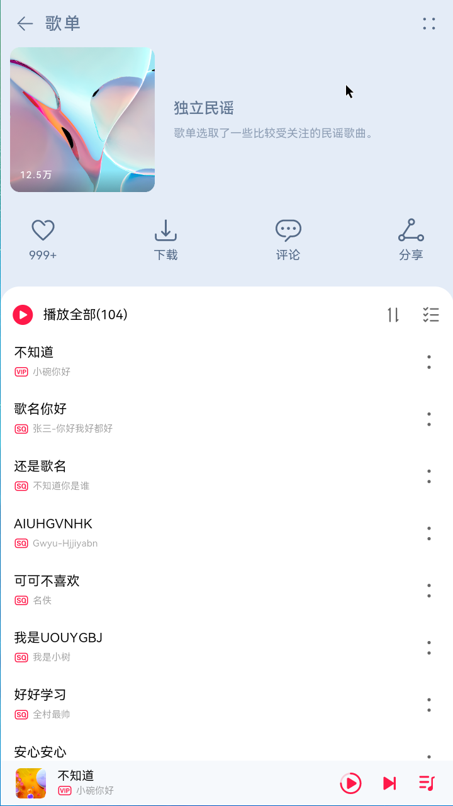
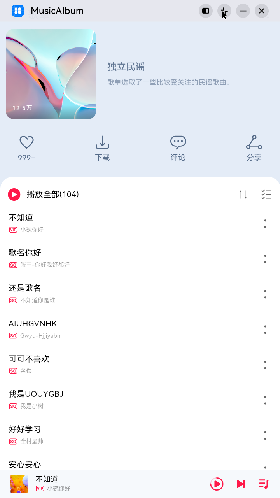
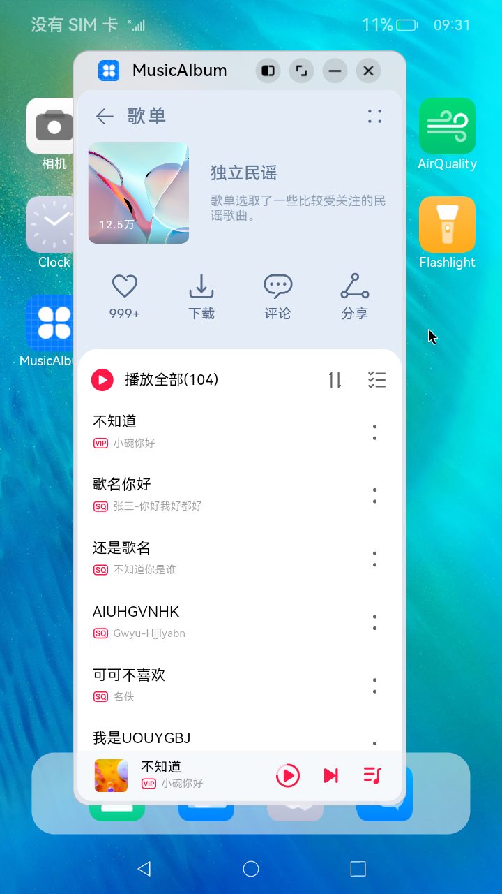

# 一多音乐专辑主页

### 介绍

本示例展示了音乐专辑主页。

* 头部返回栏: 因元素单一、位置固定在顶部，因此适合采用自适应拉伸，充分利用顶部区域。

* 专辑封面: 使用栅格组件控制占比，在小尺寸屏幕下封面图与歌单描述在同一行。

* 歌曲列表: 使用栅格组件控制宽度，在小尺寸屏幕下宽度为屏幕的100%，中尺寸屏幕下宽度为屏幕的50%，大尺寸屏幕下宽度为屏幕的75%。

* 播放器: 采用自适应拉伸，充分使用底部区域。

本示例使用[一次开发多端部署](https://developer.harmonyos.com/cn/docs/documentation/doc-guides/harmonyos-features-0000000000011907)中介绍的自适应布局能力和响应式布局能力进行多设备（或多窗口尺寸）适配，保证应用在不同设备或不同窗口尺寸下可以正常显示。

使用说明：

1.启动应用，查看本应用在全屏状态下的效果。

2.在应用顶部，下滑出现窗口操作按钮。（建议通过外接鼠标操作，接入鼠标只需要将鼠标移动至顶部即可出现窗口）

3.点击悬浮图标，将应用悬浮在其他界面上显示。

4.拖动应用悬浮窗口的四个顶角，改变窗口尺寸，触发应用显示刷新。改变窗口尺寸的过程中，窗口尺寸可能超出屏幕尺寸，此时在屏幕中只能看到应用部分区域的显示。可以通过移动窗口位置，查看应用其它区域的显示。

### 效果预览

本示例在预览器中的效果：



本示例在开发板上运行的效果：

|全屏展示               |窗口操作按钮          |悬浮窗口显示          |
|---------------------|--------------------|--------------------|
||||

### 相关权限

不涉及。

### 依赖

不涉及。

### 约束与限制

1.本示例仅支持在标准系统上运行，支持设备：华为手机或者运行在DevEco Studio上的华为手机模拟器。

2.本示例为Stage模型，从API version 9开始支持。

3.本示例需要使用DevEco Studio 3.1 Beta2 (Build Version：3.1.0.400)才可编译运行。

4.本示例在开发板上运行时，需要修改开发板系统配置文件以使能应用窗口能力。

```shell
# 将开发板文件系统的权限配置为可读写
hdc shell mount -o rw,remount /
# 取出原始配置文件
hdc file recv system/etc/window/resources/window_manager_config.xml C:\
# 将文件中<decor enable="false"></decor>改为<decor enable="true"></decor>
# 用修改后的文件替换系统中的原始文件
hdc file send C:\window_manager_config.xml system/etc/window/resources/window_manager_config.xml
# 重启后生效
hdc shell reboot
```