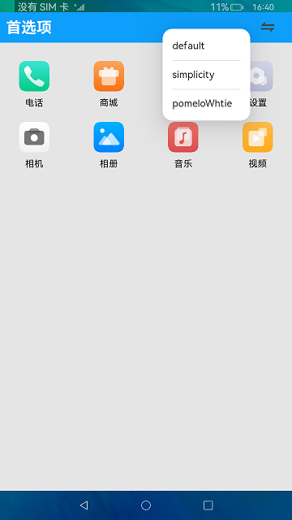

#  首选项

### 介绍

本示例主要展示了首选项在主题切换方面的功能。为应用提供key-value键值型的数据处理能力，支持应用持久化轻量级数据，并对其修改和查询。数据存储形式为键值对，键的类型为字符串型，值的存储数据类型包括数字型、字符型、布尔型以及这3种类型的数组类型。

1.点击顶部titleBar的右侧**切换**按钮，弹出主题菜单，选择任意主题则切换相应的主题界面。

2.退出应用再重新进入，显示上一次退出前的主题界面。

### 效果预览

### 相关权限

不涉及。

### 约束与限制

1. 本示例仅支持在标准系统上运行，支持设备：华为手机或者运行在DevEco Studio上的华为手机模拟器。

2. 本示例为Stage模型，从API version 9开始支持。

3. 本示例需要使用DevEco Studio 3.1 Beta2 (Build Version：3.1.0.400)才可编译运行。