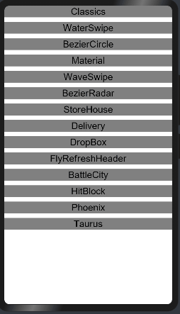

# smartrefreshlayout

## 简介
> smartrefreshlayout以打造一个强大，稳定，成熟的下拉刷新框架为目标，并集成各种的炫酷、多样、实用、美观的Header。 集成了各种炫酷的 Header。
> smartrefreshlayout可包含的信息有：BezierRadar样式、BezierCircle样式、FlyRefresh样式、Classics样式，Phoenix样式，Taurus样式，Taurus样式，HitBlock样式，WaveSwipe等众多样式。

#### 效果展示：


## 下载安装

```shell
ohpm install @ohos/smartrefreshlayout
```
OpenHarmony ohpm环境配置等更多内容，请参考 [如何安装OpenHarmony ohpm包](https://gitee.com/openharmony-tpc/docs/blob/master/OpenHarmony_har_usage.md) 。

## 使用说明

### 生成smartrefreshlayout头部刷新
```
import {SmartRefresh} from "@ohos/smartrefreshlayout"
import {Material} from "@ohos/smartrefreshlayout"

  @State model: SmartRefresh.Model = new SmartRefresh.Model()
  this.model.setBackgroundColor()
  this.model.setFixedContent()
  
  @Builder testHeader() {
    Material({ model: this.model})
  }
  
  @Builder testMain() {
    Column() {
      ForEach(this.arr, (item:string) => {
        this.card(item)
      }, item => item)
    }.width("100%").padding("20lpx")
  }
  
  build() {
    Column() {
      SmartRefresh({ model: this.model, header:() => {this.testHeader()}, main:() => {this.testMain()} })
    }.backgroundColor("#dddddd")
  }

```

## 接口说明
`@State model: SmartRefresh.Model = new SmartRefresh.Model()`
1. 背景颜色
   `model.setBackgroundShadowColor()`
2. 字体颜色
   `model.setBackgroundColor()`
3. 头部默认高度
   `model.setInitHeaderHeight()`
4. 头部是否固定
   `model.setFixedContent()`
5. 头部刷新位置
   `model.setRefreshPosition()`
6. 刷新时间是否显示
   `model.setTimeShowState()`

## 兼容性
DevEco Studio 版本： 4.1 Canary(4.1.3.317),OpenHarmony SDK:API11 (4.1.0.36)

## 目录结构
````

|---- SmartRefreshLayout
|     |---- entry  # 示例代码文件夹
|     |---- smartRefreshLayout #库文件夹
|         |----src
|            |----main
|               |----ets
|                  |----components
|                     |----topRefresh #刷新样式库
|                        |----BattleCity.ets           #BattleCity刷新样式
|                        |----BattleCityGameBody.ets   #BattleCity实体类
|                        |----BattleCityGameCover.ets  #BattleCity刷新样式
|                        |----BezierCircleRefresh.ets  #BezierCircle刷新|样式
|                        |----BezierRadarRefresh.ets   #BezierRadar刷新样式
|                        |----ClassicsRefresh.ets      #Classics刷新样式
|                        |----Delivery.ets             #Delivery刷新样式
|                        |----DropBox.ets              #DropBox刷新样式
|                        |----FlyRefreshHeader.ets     #FlyRefresh刷新样式
|                        |----HitBlock.ets             #HitBlock刷新样式
|                        |----HitBlockGameBody.ets     #HitBlock实体类
|                        |----HitBlockGameCover.ets    #HitBlock互动
|                        |----MaterialRefresh.ets      #Material刷新样式
|                        |----Phoenix.ets              #Phoenix刷新样式
|                        |----SmartRefresh.ets         #嵌入刷新样式
|                        |----SmartRefreshEntry.ets    #SmartRefresh实体类
|                        |----StackSmartRefresh.ets    #StackSmart刷新样式
|                        |----StoreHouseRefresh.ets    #StoreHouse刷新样式
|                        |----Taurus.ets               #Taurus刷新样式
|                        |----WaterSwipeRefresh.ets    #WaterSwipe刷新样式
|                        |----WaveSwipeRefresh.ets     #WaveSwipe样式刷新
|     |---- README.md  # 安装使用方法                    
````

## 贡献代码
使用过程中发现任何问题都可以提 [Issue](https://gitee.com/hihopeorg/SmartRefreshLayout/issues) 给我们，当然，我们也非常欢迎你给我们发 [PR](https://gitee.com/hihopeorg/SmartRefreshLayout/pulls) 。

## 开源协议
本项目基于 [Apache License 2.0](https://gitee.com/hihopeorg/SmartRefreshLayout/blob/master/LICENSE) ，请自由地享受和参与开源。