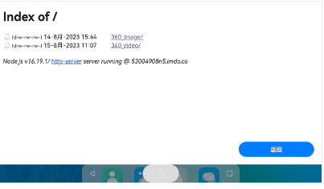

## ThreeJs360Demo

### 介绍

ThreeJs360Demo,使用系统提供的Web组件，加载threeJs，实现360度的全景渲染功能

### 效果展示



### 支持的图片与视频格式
| 格式 | 备注 |
| :-----| :------|
|图片JPG格式|支持|
|图片PNG格式|支持|
|图片GIF格式|支持（失去原图的动态效果）|
|视频MP4格式|支持|
|视频WEBPM格式|支持|

### 样例说明

参照该Demo工程[Index](./entry/src/main/ets/pages/Index.ets)页面

如：

```
    //https://53004908n5.imdo.co   ThreeJs实现全景效果的h5页面 服务器地址
   Web({ src: "https://53004908n5.imdo.co", controller: this.controller })
        .width('100%')
        .height('100%')
        .margin({ top: 10 })
        .imageAccess(true)
        .horizontalScrollBarAccess(true)
        .onProgressChange((ev) => {
          console.log("ThreeJs360 progress:" + ev.newProgress);
        })
        .onErrorReceive((error) => {
          console.log("ThreeJs360 error:" + error.error.getErrorInfo() + ";code:" + error.error.getErrorCode());
          console.log("ThreeJs360 error url:" + error.request.getRequestUrl());
        })
```

### 使用说明

1丶将工程目录中的source文件下代码放到搭建的服务器


2丶在对应的html5页面，设置资源文件（图片或者视频）

图片:在对应的h5页面中引入对应js文件丶设置展示图片的div标签及其设置图片的路径及其初始化角度

引入source/360_image/js目录下的js文件
```
   <script src="./js/three.js"></script>
   <script src="./js/index.js"></script>
```

div标签
```
   <div id="pano-container"></div>
```

设置图片路径及其初始化
```
    const container = document.getElementById("pano-container");
    Panorama.init(container, "xxxxxxx.jpg图片地址", 180);
```

视频：设置视频播放的video组件丶设置threejs绑定的canvas组件及其引入视频处理的js文件

定义视频播放的video组件，定义的id需要保持my_video
```
  <video
        preload
        ref="video"
        controls
        loop
        style="width: 100%; visibility: hidden; position: absolute"
        src="xxxxxxxxxxxxxxxxxxxxx.mp4视频地址"
        class="my_video"
        ></video>
```

定义绑定threeJs的canvas组件，定义的id需要保持my_canvas
```
  <canvas
        style="width: 100%; height: 100vh"
        width="1920"
        height="823"
        ref="canvas"
        class="my_canvas"
        ></canvas>
```

引入source/360_video/360_video-umd.js文件
```
   <script src="./360_video-umd.js"></script>
```


3丶启动资源服务器，在当前的source目录运行cmd，输入以下命令，启动资源服务器

```
    运行命令：npx http-server.
```


4丶web组件访问上述启动服务器

```
    controller: web.WebviewController = new web.WebviewController();
    ...
    Web({ src: "http://服务器地址", controller: this.controller })
```

### 图片接口说明
| 接口说明 | 功能描述 |
| :-----| :------|
|init: function (container, imgPath, compassAngle)|初始化功能，设置图片的地址及其图片的展示角度（0-360度）|
|updateMesh: function (imgPath)|刷新图片|
|resetParams: function () |图片层的Params重置|

视频层未暴露出接口，以script标签引入js文件，设置对应的vidoe组件id为my_video及其canvas组件id为my_canvas

### 软件架构

```
|-ets
|   |-entryability
|           |-EntryAbility.ts
|   |-pages
|           |-Index.ets             #主页demo
|-doc      #threeJs实现源码
```

### 约束与限制

在下述版本验证通过：

DevEco Studio: 4.0 Canary2(4.0.1.300), SDK: API10 Beta(4.0.8.6)

### 贡献代码

使用过程中发现任何问题，都可以提[Issue](https://gitee.com/openharmony-tpc/openharmony_tpc_samples/issues)
给我们，当然，我们也非常欢迎给我们发[PR](https://gitee.com/openharmony-tpc/openharmony_tpc_samples/pulls)

### 开源协议

本项目基于[Apache License 2.0](./LICENSE)
,请自由的享受和参与开源