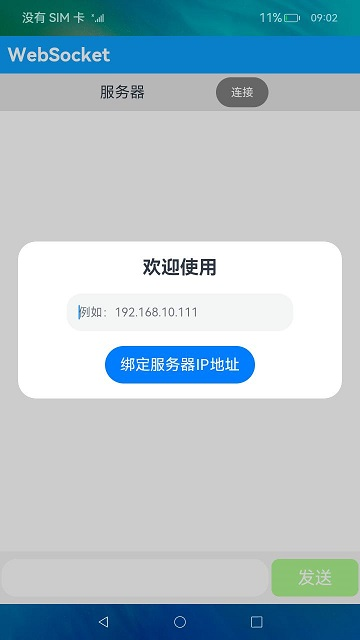

# WebSocket

### 介绍

本示例展示了WebSocket的使用，包括客户端与服务端的连接和断开以及客户端数据的接收和发送。

WebSocket连接：使用WebSocket建立服务器与客户端的双向连接，需要先通过createWebSocket方法创建WebSocket对象，然后通过connect方法连接到服务器。

使用方法：

1.输入服务器IP地址，点击**绑定服务器IP地址**按钮，即可绑定该IP并退出弹框，如果要解绑IP，重启应用即可。

2.点击顶部栏的**连接**按钮，按钮颜色从灰色变为绿色，即可与服务器建立WebSocket连接。

### 效果预览

### 相关权限

[ohos.permission.INTERNET](https://developer.harmonyos.com/cn/docs/documentation/doc-guides/permission-list-0000001281480750)

### 依赖
依赖于[WebSocketServer](https://gitee.com/adslk/application_server/tree/master/WebSocketServer)服务器才能实现相关功能。

### 约束与限制

1.本示例仅支持在标准系统上运行，支持设备：华为手机或者运行在DevEco Studio上的华为手机模拟器。

2.本项目仅包含客户端，不包含服务端，当前服务端回复客户端为固定消息。

3.本示例为Stage模型，  支持API version 9版本SDK。

4.本示例需要使用DevEco Studio 3.1 Beta2 (Build Version：3.1.0.400)版本进行编译运行。