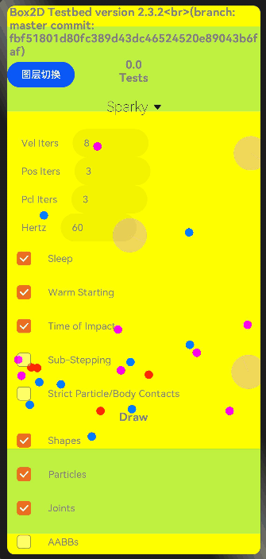

# box2d

## 简介

> 用于游戏开发，使物体的运动更加真实，让游戏场景看起来更具交互性，比如愤怒的小鸟

## 效果展示


## 下载安装

```shell
ohpm install @ohos/box2d
```

OpenHarmony ohpm环境配置等更多内容，请参考 [如何安装OpenHarmony ohpm包](https://gitee.com/openharmony-tpc/docs/blob/master/OpenHarmony_har_usage.md)

## 使用说明

   ```
   import * as box2d from '@ohos/box2d'
   ...
   
  aboutToAppear() {
    selectArr = [];
    
    for (let i: number = 0; i < g_testEntries.length; ++i) {
      let o = {};
      o['value'] = g_testEntries[i].name;
      selectArr[i] = o;//初始化数据
    }
        //循环调用渲染
        this.init();
    }
    private init() {
        setTimeout(inits, timeStep);
    }
    const inits = function (time) {
      setTimeout(loop, timeStep);
    }
    
    const loop = function (time) {
      setTimeout(loop, timeStep);
      app.SimulationLoop(time);
    }

   ...
       //动画切换
       Select(selectArr)
              .selected(this.index)
              .value(selectArr[this.index].value)
              .font({ size: 20, weight: 200, family: 'serif', style: FontStyle.Normal })
              .selectedOptionFont({ size: 30, weight: 300, family: 'serif', style: FontStyle.Normal })
              .optionFont({ size: 20, weight: 200, family: 'serif', style: FontStyle.Normal })
              .onSelect((index: number) => {
                this.index = index;
                if (app) {
                  app.m_test_index = index;
                  //加载动画
                  app.LoadTest();
                }
              })
   ```

## 接口说明

### b2Body类接口 
1. 创建夹具
   `CreateFixture()`
2. 销毁夹具
   `DestroyFixture()`
3. 设置变换
   `SetTransform()`
4. 获取变换
   `GetTransform()`
5. 获取位置
   `GetPosition()`
6. 设置位置
   `SetPosition()`
7. 获取世界中心
   `GetWorldCenter()`
8. 获取本地中心
   `GetLocalCenter()`
9. 设置线性速度
   `SetLinearVelocity()`

### b2World类接口
1. 设置子步长
   `setSubStepping()`
2. 设置销毁侦听器
   `SetDestructionListener()`
3. 设置接触筛选器
   `SetContactFilter()`
4. 设置接触监听
   `SetContactListener()`
5. 设置调试绘图
   `SetDebugDraw()`
6. 创建刚体
   `CreateBody()`
7. 销毁刚体
   `DestroyBody()`
8. 创建关节
   `CreateJoint()`
9. 销毁关节
   `DestroyJoint()`

### b2Contact类接口
1. 重置
   `Reset`
2. 获取歧管
   `GetManifold`
3. 获取世界歧管
   `GetWorldManifold`
4. 设置切线速度
   `SetTangentSpeed`
5. 重置摩擦力
   `ResetFriction`
6. 设置摩擦力
   `SetFriction`
7. 设置是否启用
   `SetEnabled`
8. 获取夹器A
   `GetFixtureA`

### b2Shape类接口
1. 光线投射
   `RayCast`
2. 获取类型
   `GetType`
3. 拷贝
   `Copy`
4. 获取孩子数量
   `GetChildCount`
5. 计算AABB
   `ComputeAABB`
6. 计算质量
   `ComputeMass`
7. 计算距离
   `ComputeDistance`
8. 克隆
   `clone`

## 约束与限制

在下述版本验证通过：

- DevEco Studio 版本： 4.1 Canary(4.1.3.317)

- OpenHarmony SDK:API11 (4.1.0.36)

## 目录结构
````
|---- box2d
|     |---- entry
|	        |----src
|                |----main
|                     |----ets
|                          |----pages
|                               |----Index.ets                          # 效果主页面
|                          |----Testbed
|                               |----Framework 
|                                    |----DebugDraw.ets                 # 效果绘制具体实现
|                                    |----FullscreenUI.ts               # 全局页面初始化，是否启用粒子参数
|                                    |----Main.ets                      # 效果绘制入口
|                                    |----ParticleEmitter.ts            # 粒子发射器
|                                    |----ParticleParameter.ts          # 粒子参数
|                                    |----Test.ets                      # canvas相关初始化设置
|                               |----Tests                              # 所有效果具体实现
|                               |----Testbed.ts                         # 对外接口
|     |---- library                                                       # box2d核心库
|	        |----src
|                |----main
|                     |----ets
|                          |----Box2D
|                               |----Collision                          # 碰撞目录
|                                    |----Shapes                        # 形状目录
|                                         |----b2ChainShape.ts          # 链条形状
|                                         |----b2CircleShape.ts         # 圆形状
|                                         |----b2EdgeShape.ts           # 边缘形状
|                                         |----b2PolygonShape.ts        # 多边形形状
|                                         |----b2Shape.ts               # 形状抽象类
|                                    |----b2BroadPhase.ts               # 广义定义
|                                    |----b2CollideCircle.ts            # 圆形碰撞
|                                    |----b2CollideEdge.ts              # 边缘碰撞
|                                    |----b2CollidePolygon.ts           # 多边形碰撞
|                                    |----b2Collision.ts                # 碰撞类
|                                    |----b2Distance.ts                 # 距离类
|                                    |----b2DynamicTree.ts              # 动态树
|                                    |----b2TimeOfImpact.ts             # 影响时间
|                               |----Common                             # 通用代码：绘制、设置、定时器等
|                                    |----b2BlockAllocator.ts           # 块分配器
|                                    |----b2Draw.ts                     # 绘制类
|                                    |----b2GrowableStack.ts            # 生长堆栈
|                                    |----b2Math.ts                     # 数学计算类
|                                    |----b2Settings.ts                 # 设置类
|                                    |----b2StackAllocator.ts           # 堆栈分配器
|                                    |----b2Timer.ts                    # 计时器类
|                               |----Controllers                        # 控制器目录
|                                    |----b2BuoyancyController.ts       # 浮力控制器
|                                    |----b2ConstantAccelController.ts  # 恒定加速度控制器
|                                    |----b2ConstantForceController.ts  # 恒力控制器
|                                    |----b2Controller.ts               # 重力控制器
|                                    |----b2GravityController.ts        # 张量阻尼控制器
|                               |----Dynamics
|                                    |----Contacts                      # 接触类目录
|                                    |----Joints                        # 关节目录
|                                    |----b2Body.ts                     # 刚体类
|                                    |----b2ContactManager.ts           # 接触管理类
|                                    |----b2Fixture.ts                  # 夹具类
|                                    |----b2Island.ts                   # 岛类
|                                    |----b2TimeStep.ts                 # 时间步类
|                                    |----b2World.ts                    # 世界类
|                                    |----b2WorldCallbacks.ts           # 世界回调类
|                               |----Particle                           # 粒子目录
|                                    |----b2Particle.ts                 # 粒子类
|                                    |----b2ParticleGroup.ts            # 粒子群类
|                                    |----b2ParticleSystem.ts           # 粒子系统类
|                                    |----b2StackQueue.ts               # 堆栈队列类
|                                    |----b2VoronoiDiagram.ts           # 诺图类
|                               |----Rope                               # 绳索目录
|                                    |----b2Rope.ts                     # 绳索
|                               |----Box2D.ts                           # 所有接口导出类
|                               |----box2d.umd.js                       # 所有接口导出实现类
|     |---- README.md                                                   # 安装使用方法                    
````

## 贡献代码

使用过程中发现任何问题都可以提 [Issue](https://gitee.com/openharmony-tpc/openharmony_tpc_samples/issues) 给我们，当然，我们也非常欢迎你给我们发 [PR](https://gitee.com/openharmony-tpc/openharmony_tpc_samples/pulls) 。

## 开源协议

本项目基于 [MIT License](https://gitee.com/openharmony-tpc/openharmony_tpc_samples/blob/master/box2d/LICENSE) ，请自由地享受和参与开源。

