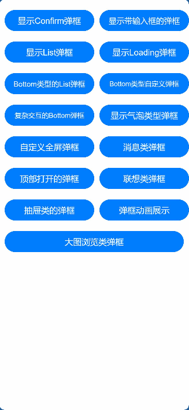
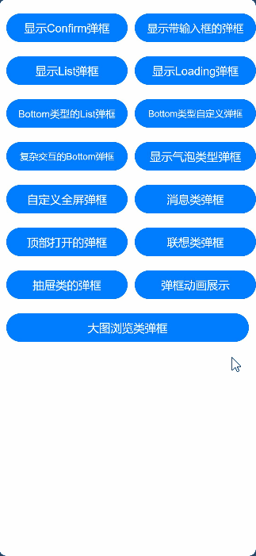
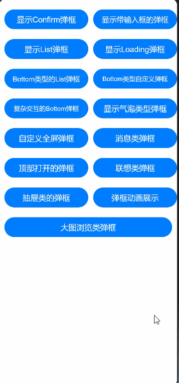
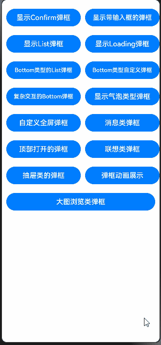
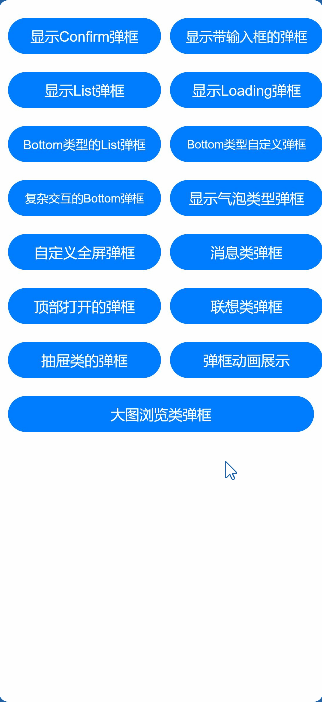
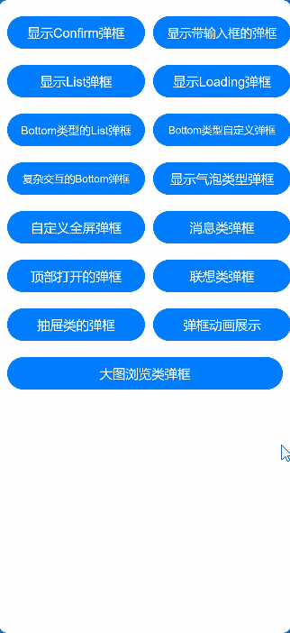
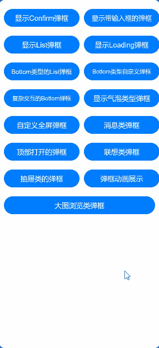
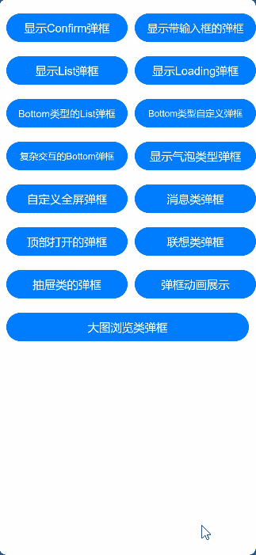
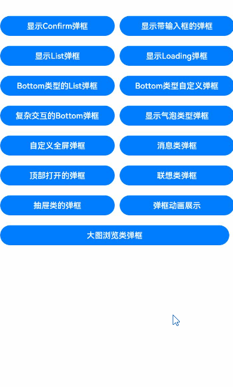

# dialogs

## 介绍
本项目是基于OpenHarmony的弹框基础能力和自定义能力，针对通用的弹框业务场景进行封装组合，实现了确认输入弹窗、列表展示选择弹窗、自定义底部、顶部弹窗、自定义动画弹窗、自定义全屏弹窗、
消息类弹窗、抽屉类弹、联想类弹窗、图片浏览弹窗等相关组件弹窗功能，提供一款OpenHarmony版的三方UI库。

## demo样例

1.支持内容确认弹窗



2.支持input弹窗


3.支持列表list弹窗



4.支持loading动画弹窗


5.支持bottom列表互弹窗


6.支持bottom自定义弹窗



7.支持bottom复杂交互弹窗


8.支持气泡类弹窗



9.支持自定义全屏弹窗



10.支持消息类弹窗



11.支持顶部弹窗


12.支持联想类弹窗



13.支持抽屉类弹窗



14.支持自定义动画弹窗


15.支持大图浏览弹窗




## 下载安装

1.安装

```
ohpm install @ohos/dialog
```

2.在需要使用的页面导入需要的组件，如ConfirmDialog.ets:

```
import { ConfirmDialog } from '@ohos/dialog'
```

## 使用说明

以Confirm为例
   ```typescript
import { ConfirmDialog } from '@ohos/dialogs'
import { BaseCenterMode } from '@ohos/dialogs'  //自定义属性
import { TestType } from '@ohos/hypium'

@Entry
@Component
struct ConfirmExample {
  @State textValue: string = '我是标题'
  @State contentValue: string = '床前明月光，疑是地上霜，举头望明月，低头思故乡。床前明月光，疑是地上霜，举头望明月，低头思故乡。'
  @State inputValue: string = 'click me'
  @State positionDialog: string = 'center'
  @State animitionMove:string = 'center'
  @State model:BaseCenterMode = new BaseCenterMode()

  aboutToAppear(){
    this.model.title = '我是标题',
    this.model.contentValue = '床前明月光，疑是地上霜，举头望明月，低头思故乡。床前明月光，疑是地上霜，举头望明月，低头思故乡。'
    // this.model.contentMargin = 20
    this.model.titleMargin = { top: 30,bottom: 10 }
this.model.btnWidth = '100%'
this.model.btnHeight = '100%'
this.model.confirmBtnFontColor = '#87C5BF'
this.model.confirmBtnBgColor = '#fff'
this.model.confirm = this.onAccept
this.model.btnContentHeight = 60
this.model.btnContentMargin = { top: 20 }
this.model.btnContentBorder = {
  width: { top: 1 },
  color:{ top:'#F0F0F0' },
  style:{ top:BorderStyle.Solid },
}
}

dialogController: CustomDialogController = new CustomDialogController({
  builder: ConfirmDialog({
    slotContent: () => {
      this.componentBuilder()
    },
    model:this.model
  }),
  cancel: this.existApp,
  autoCancel: true,
  alignment: DialogAlignment.Center,
  offset: { dx: 0, dy: 0 },
  gridCount: 4,
  customStyle: true
})

// 在自定义组件即将析构销毁时将dialogControlle删除和置空
aboutToDisappear() {
  delete this.dialogController, // 删除dialogController
  this.dialogController = undefined // 将dialogController置空
}

onAccept() {
  console.info('Callback when the second button is clicked')
}

existApp() {
  console.info('Click the callback in the blank area')
}

//自定义内容
@Builder componentBuilder() {
  Text('床前明月光，疑是地上霜，举头望明月，低头思故乡。床前明月光，疑是地上霜，举头望明月，低头思故乡。')
    .fontSize(this.model.contentFontSize)
    .margin(20)
    .textAlign(this.model.contentTextAlign)
}

build() {
    Column() {
      Button('显示confirm弹窗').onClick(() => {
        this.dialogController.open()
      })
    }
}
}
```

## 全局属性说明
| 属性名                 | 属性类型             | 属性描述                           |
|---------------------|------------------|--------------------------------|
| autoClose           | function         | 是否允许操作后关闭弹窗，用于确认，选择按钮场景        |
| popupAnimation      | TransitionEffect | 弹窗动画器，支持自定义能力                  |
| positionDialog      | string           | 弹窗弹出后的位置 Left-Right-Top-Bottom |
| isSupportGesture    | boolean          | 是否支持手势拖拽                       |
| isDeleteOnDisappear | boolean          | 是否在弹框退出时，删除对象，释放资源                       |
| customCallback      | CustomCallback   | 设置弹窗build前和build后的回调                       |

#### 组件属性说明

**confirmDialog**

确认弹窗

参数：

| 参数名             | 类型                          | 必填 | 说明                |
| ------------------ | ----------------------------- | ---- |-------------------|
| slotContent | @Builder                      | 是   | confirm组件的内容布局插槽。 |

**inputDialog**

带输入框弹窗

参数：

| 参数名             | 类型                         | 必填 | 说明                |
| ------------------ | ---------------------------- | ---- |-------------------|
| inputValue | string                      | 是   | 弹窗输入框值。 |


**listSelectDialog**

列表弹窗，支持单选、多选

参数：

| 参数名             | 类型            | 必填 | 说明   |
| ------------------ |---------------| ---- |------|
| arrList | object[]      | 是   | 列表数据 |

**loadingDialog**

加载动画弹窗

参数：

| 参数名             | 类型     | 必填 | 说明   |
| ------------------ |--------| ---- |------|
| loadingTitle | string | 是   | 加载标题 |

**bottom自定义**

底部自定义弹窗

参数：

| 参数名             | 类型     | 必填 | 说明                 |
| ------------------ |--------| ---- |--------------------|
| customComponent | function | 是   | 返回一个Builder，用做内容插槽 |
| arr | string[] | 是   | 列表内容描述             |
| dialogInput | CustomDialog | 是   | 用来做二次弹窗            |


customComponent参数：

| 方法名    | 参数                            | 说明     |
| --------- |-------------------------------|--------|
| customComponent  | item：string, itemIndex：number | 插槽内容显示 |

返回值：

| 类型                  | 说明          |
| --------------------- |-------------|
|  @Builder   | 返回一个自定义插槽内容 |


**复杂交互bottom**

参数：

| 参数名             | 类型       | 必填  | 说明                 |
| ------------------ |----------|-----|--------------------|
| customComponent | function | 是   | 返回一个Builder，用做内容插槽 |
| arr | string[] | 是   | 列表内容描述             |
| dialogTitle | string   | 是   | 弹窗标题               |
| scrollEmptyHeight | number   | 否   | 控件内部使用，滑动控制，默认值20  |


**popopDialog**

气泡类型弹窗

参数：

| 参数名             | 类型        | 必填 | 说明    |
| ------------------ |-----------| ---- |-------|
| placement | Placement | 是   | 消息弹出位置 |
| firstText | string    | 是   | 左侧文字  |
| secondText | string    | 是   | 右侧文字  |

**fullScreen**

全屏弹窗

参数：

| 参数名             | 类型                        | 必填    | 说明           |
| ------------------ | --------------------------- |-------|--------------|
| slotContent | @Builder                    | 是     | 全屏组件的内容布局插槽。 |
| slotBgColor | string | 否            | 弹窗背景色，默认为白色  |

**message**

消息弹出

参数：

| 参数名             | 类型     | 必填  | 说明                           |
| ------------------ |--------|-----|------------------------------|
| positionDialog | string | 是   | 消息显示位置 top-left-right-bottom |
| blurValue | number | 是   | 背景模糊值                        |

**topDialog**

顶部弹窗

参数：

| 参数名             | 类型       | 必填  | 说明                           |
| ------------------ |----------|-----|------------------------------|
| slotContent | @Builder | 是   | 顶部组件的内容布局插槽。                 |
| isAnimation | boolean  | 是   | 是否动画显示弹窗，true不显示动画，false显示动画 |

**realtimeInput**

联想类型弹窗

参数：

| 参数名             | 类型     | 必填  | 说明    |
| ------------------ |--------|-----|-------|
| inputVal | string | 是   | 输入值   |

**sideBarCustomDialog**

抽屉类弹窗

参数：

| 参数名             | 类型     | 必填  | 说明   |
| ------------------ |--------|-----|------|
| customComponent | @Builder | 是   | 内容插槽 |


**positionDialog**

自定义动画弹窗

参数：

| 参数名             | 类型                  | 必填  | 说明     |
| ------------------ |---------------------|-----|--------|
| slotContent | @Builder            | 是   | 内容插槽   |
| animateOptions | AnimateDialogOptions | 是   | 默认弹窗动画 |
| duration | number              | 是   | 动画时长   |
| curve | Curve              | 是   | 动画方式   |

**imageBrowser**

大图浏览弹窗

参数：

| 参数名       | 类型    | 必填  | 说明     |
|-----------|-------|-----|--------|
| imageList | Resource[] | 是   | 图片列表资源 |
| index     | number              | 是   | 显示图片下标 |

## 约束与限制

在下述版本验证通过：

DevEco Studio: 4.1 Canary2 (4.1.3.322), SDK: API11 (4.1.3.1)


## 软件架构
软件架构说明
```

|---- Xpopup 
|    |----Dialog  #组件文件夹
        |----src #组件入口文件夹
            |----main
                |----ets
                    |----components #组件库
                        |----confirmDialog #显示confirm弹窗
                        |----InputDialog  #显示带输入框的弹窗
                        |----listSelectDialog  #显示列表弹窗
                        |----loadingDialog  #显示loading弹窗
                        |----bottonDialog 
                            |----BottomListDialog #显示bottom类型的列表弹窗
                            |----BottomScrollDialog #显示bottom类型的自定义弹窗 #复杂交互的bottom弹窗
                        |----popupBottom  #显示气泡类弹窗
                        |----fullScreenDialog  #显示自定义全屏弹窗
                        |----messageDialog  #显示消息类弹窗
                        |----topDialog   #显示顶部打开弹窗
                        |----realtimeInputPopup  #显示联想类弹窗
                        |----sliderdialog   #显示抽屉类弹窗  #大图浏览类弹窗
                        |----positionDialog   #显示自定义动画弹窗
                        |----imageBrowser   #显示大图浏览弹窗
        |----resource
        |----index   #组件向外暴露组件
|    |----entry  #页面入口文件夹
        |----src #组件入口文件夹
            |----main
                |----ets
                    |----components #页面公用组件文件夹
                    |----entryability #组件页面配置
                    |----pages  #页面入口文件夹
                    |----utils #页面公用方法文件夹
                |----resource #项目资源配置
                    |----base
                        |----profile 
                            |----main_pages.json #页面路由配置文件

```


## 贡献代码

使用过程中发现任何问题都可以提 [Issue](https://gitee.com/openharmony-tpc/openharmony_tpc_samples/issues) 给我们，当然，我们也非常欢迎你给我们发 [PR](https://gitee.com/openharmony-tpc/openharmony_tpc_samples/pulls) 。

## 开源协议

本项目基于 [Apache-2.0 License](https://gitee.com/openharmony-tpc/openharmony_tpc_samples/blob/master/dialogs/LICENSE) ，请自由地享受和参与开源。