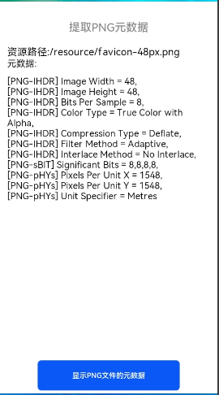
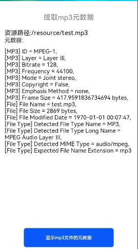
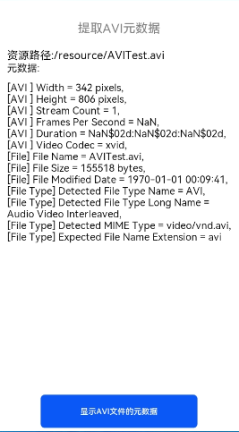

# metadata-extractor

## 简介

> metadata-extractor是用于从图像、视频和音频文件中提取 Exif、IPTC、XMP、ICC 和其他元数据的组件。





## 下载安装

```shell
ohpm install @ohos/metadata-extractor
```

OpenHarmony
ohpm环境配置等更多内容，请参考 [如何安装OpenHarmony ohpm包](https://gitee.com/openharmony-tpc/docs/blob/master/OpenHarmony_har_usage.md) 。

## 使用说明

1. 引入文件及代码依赖

 ```
    import {Metadata} from '@ohos/metadata-extractor'
    import {ImageMetadataReader} from '@ohos/metadata_extractor'
 ```

2. 读取数据

 ```
  private getMetaData() {
    let path = globalThis.fileDir.concat("/AVITest.avi")
     let metadata: Metadata = ImageMetadataReader.readMetadata(path)
      // iterate over the metadata and print to System.out
      for (let directory of metadata.getDirectories()) {
        let directoryName = directory.getName()
        for (let tag of directory.getTags()) {
          let tagName = tag.getTagName()
          let description = tag.getDescription()

          // truncate the description if it's too longzg zg
          if (description != null && description.length > 1024) {
            description = description.substring(0, 1024) + "..."
          }
          this.data.push("\n" + "[" + directoryName + "] " + tagName + " = " + description)
        }
      }
  }
 ```

3. 展示数据

 ```
Column() {
  Text("元数据:" ).fontSize(20).width('100%')
    .textAlign(TextAlign.Start)
  Text("" + this.data).fontSize(20).width('100%')
    .textAlign(TextAlign.Start)
    .visibility(this.isVisibility)
}.height("80%").padding({ bottom: 10 })
 ```

## 接口说明

#### 说明：支持ImageMetadataReader.readMetadata(path)统一入口；也支持对应文件格式下下的MetadataReader: 如:PngMetadataReader.readMetadata(filepath);JpegMetadataReader.readMetadata(filepath)

1. 获取元数据`ImageMetadataReader.readMetadata()`
2. 获取目录信息`Metadata.getDirectories()`
3. 获取目录类型`Metadata.getDirectoriesOfType()`
4. 获取目录数量`Metadata.getDirectoryCount()`
5. 获取首目录类型`Metadata.getFirstDirectoryOfType()`
6. 获取目录名称`Directory.getName()`
7. 获取标签信息`Directory.getTags()`
8. 获取标签数量`Directory.getTagCount()`
9. 获取父目录信息`Directory.getParent()`
10. 获取日期信息`Directory.getDate()`
11. 获取标签名称`Tag.getTagName()`
12. 获取标签名称`Tag.getgetDescription()`

## 约束与限制

在下述版本验证通过：

- DevEco Studio 版本： 4.1 Canary(4.1.3.317)

- OpenHarmony SDK:API11 (4.1.0.36)

## 目录结构

````
|---- metadata-extractor
|     |---- entry  # 示例代码文件夹
|     |---- library # 库文件夹
|           |---- index.ets  # 对外接口
|           |---- src
|                 |---- main
|                       |---- com
|                             |---- drew
|                                   |---- imaging  #文件解析器（包含图片、音频、视频）
|                                          |---- avi  #avi视频格式解析
|                                          |---- gif  #gif图片格式解析
|                                          |---- jpeg #jpeg图片格式解析
|                                          |---- mp3 #mp3图片格式解析
|                                          |---- mp4 #mp4图片格式解析
|                                          |---- FileType.ets # 文件类型
|                                          |---- FileTypeDetector.ets  #文件格式识别
|                                          |---- ImageMetadataReader.ets #文件数据解析总入口
|                                          |---- ImageProcessingException.ets #异常情况处理
|                                          |---- TypeChecker.ets #文件格式接口回调器
|                                   |---- lang   #工具类
|                                          |---- StreamReader.ets   #文件流读取器
|                                   |---- metadata  #文件数据配置，包括字典之类
|                                          |---- avi #获取avi格式的文件数据
|                                          |---- gif #获取avi格式的文件数据
|                                          |---- jpeg #获取avi格式的文件数据
|                                          |---- mp3 #获取avi格式的文件数据
|                                          |---- mp4 #获取avi格式的文件数据
|                                          |---- Directory.ets #数据字典抽象类
|                                          |---- Metadata.ets #文件具体数据
|                                          |---- MetadataReader.ets #文件具体数据读取
|                                          |---- Tag.ets #指定字典类型
|                                          |---- TagDescriptor.ets #指定字典类型描述
|     |---- README.md  # 安装使用方法                    
````

## 贡献代码

使用过程中发现任何问题都可以提 [Issue](https://gitee.com/openharmony-tpc/openharmony_tpc_samples/issues)
给我们，当然，我们也非常欢迎你给我们发 [PR](https://gitee.com/openharmony-tpc/openharmony_tpc_samples/pulls) 。

## 开源协议

本项目基于 [Apache-2.0 License](https://gitee.com/openharmony-tpc/openharmony_tpc_samples/blob/master/metadata-extractor/LICENSE)
，请自由地享受和参与开源。