# 服务构建以及测试说明

##  配置服务器

1. 下载服务软件

如下图，通过https://igniterealtime.org/downloads/地址下载最新版的Openfire并安装作为服务器

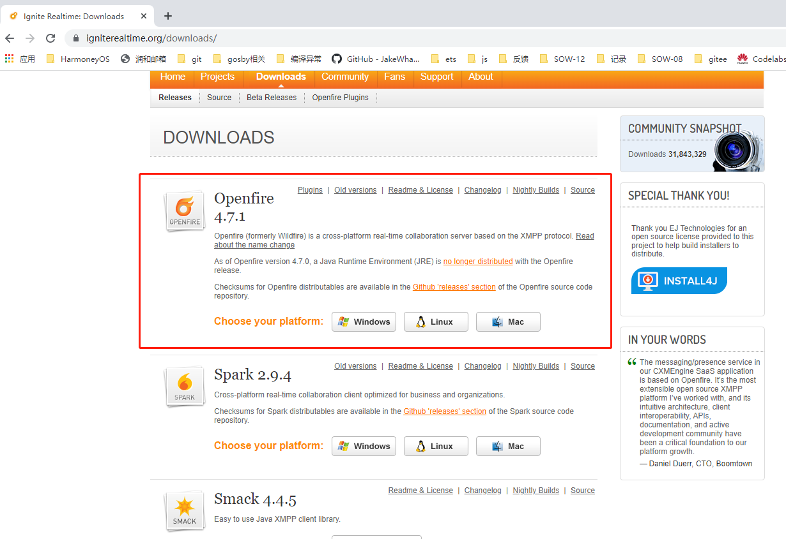

2. 安装配置，以windows-64位 的安装为例：

下载的安装文件openfire_4_7_1_x64.exe 右击选择 以管理员身份运行。

 

语言选择默认中文点击确定，如图

点击下一步，如图

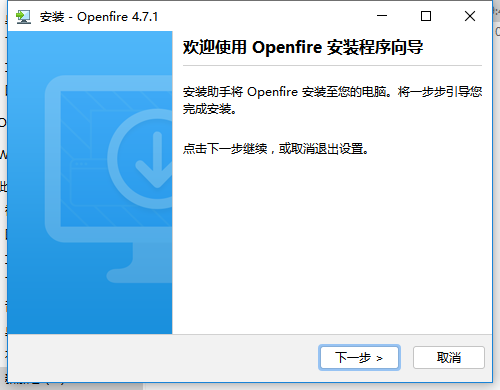

点击完成，如图

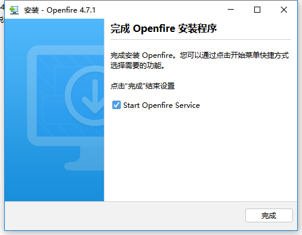

3. 浏览器跳转到服务配置页，选择语言中文（简体），然后点击Continue 按钮如下图

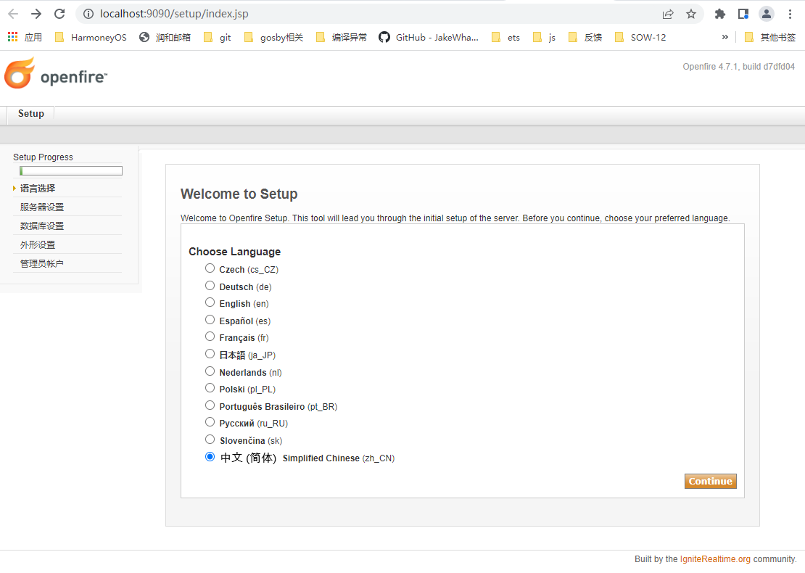

4. 填写服务器配置，域和Server Host name都填写为主机名如he-202101111234，如下图

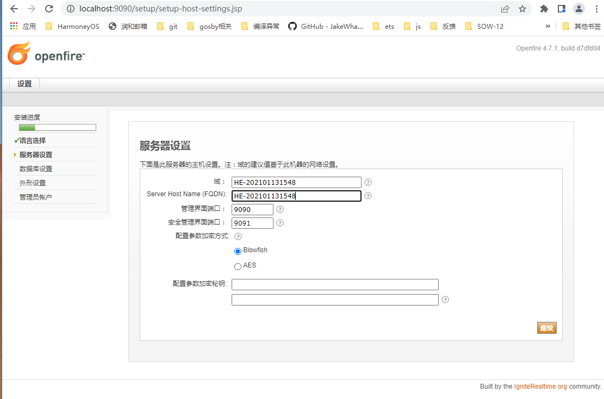

5. 配置数据库，选择嵌入的数据库，如下图

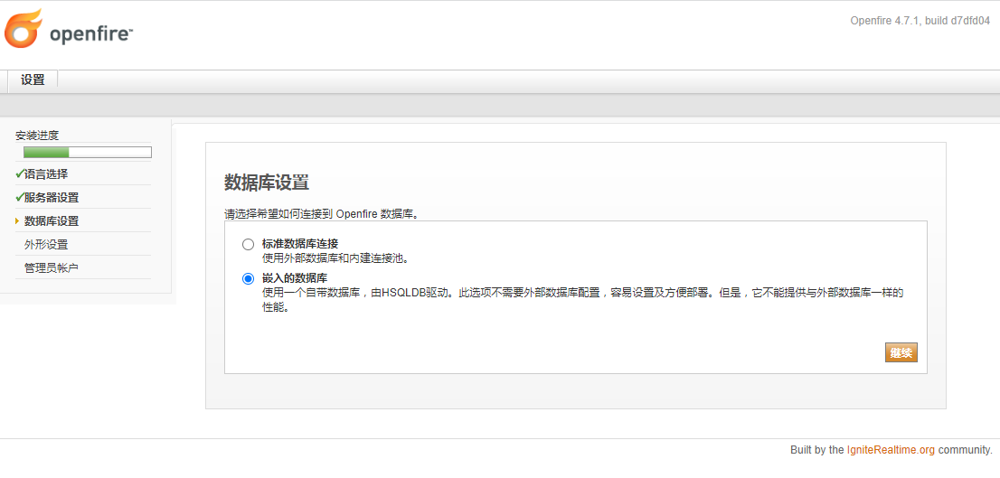

6. 选择用户和组系统使用Openfire，点击继续，如下图

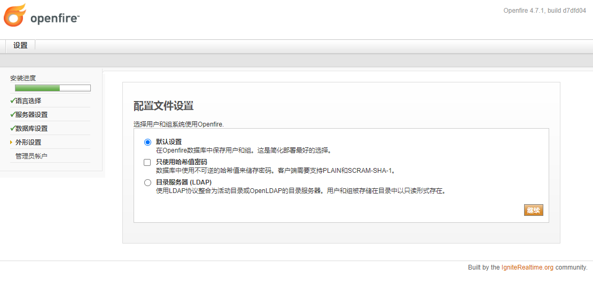

7. 设置管理员账户，填写信息后点击继续按钮，如下图

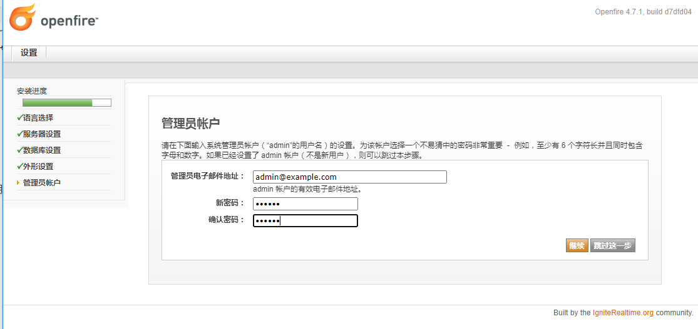

8. 页面选择登录到管理界面，如下图

9. 登录界面（http://10.50.40.65:9090/index.jsp）输入账户信息，点击登录，如下图

10. 进入管理界面，服务配置完成并启动，如下图

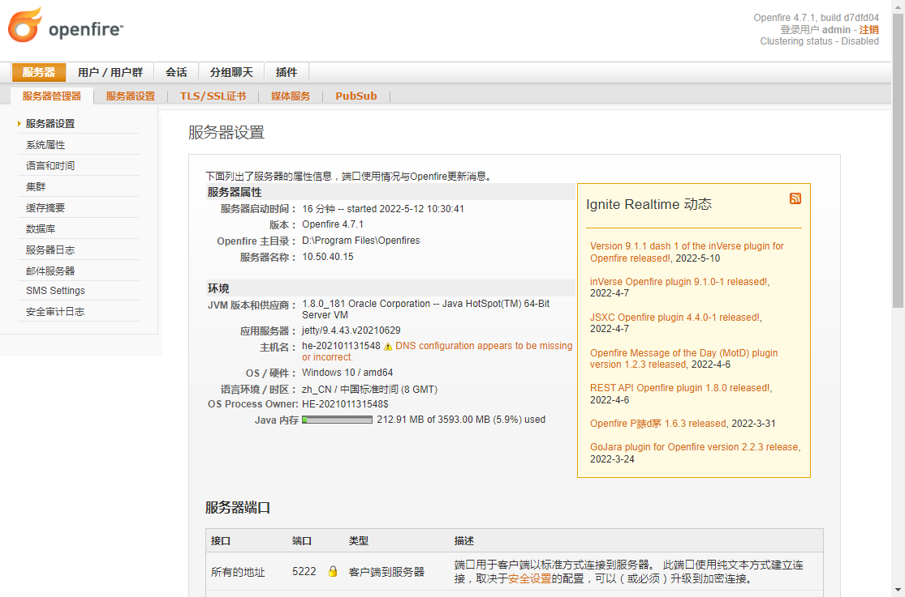

服务后台查看通过，http://10.50.40.65:9090/index.jsp进入 

## 关闭Windows 防火墙

1. 打开防火墙设置页，点击更改通知设置，如下图

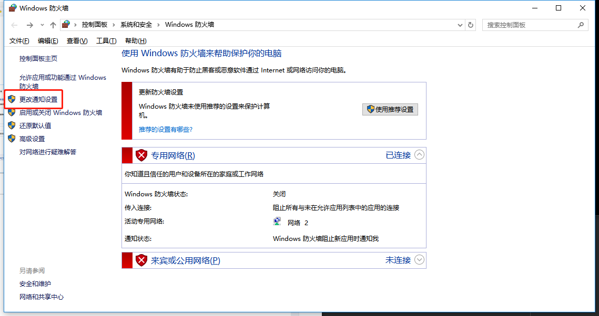

2. 关闭防火墙，点击确定，如下图：

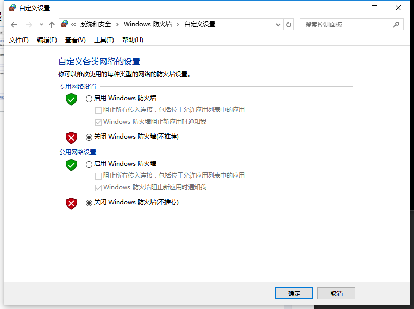

 

## 设备连接与网络验证

Rk-3568（大禹板子）连接WiFi后，查看部署服务是否可用：

打开命令窗，通过hdc_std shell进入shell，通过ping 10.50.40.65（上面配置服务器所在的IP）检测，如图18即为连接配置成功：

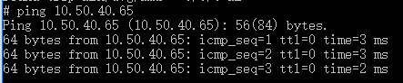

## 应用内服务地址配置：

设置服务信息，如Constant.ets类中的设置：

static HOST_IP: string = "10.50.40.65"           （上面配置服务器所在的IP）

static HOST_DOMAIN: string = "he-202101111234" （上面配置填写的主机名）