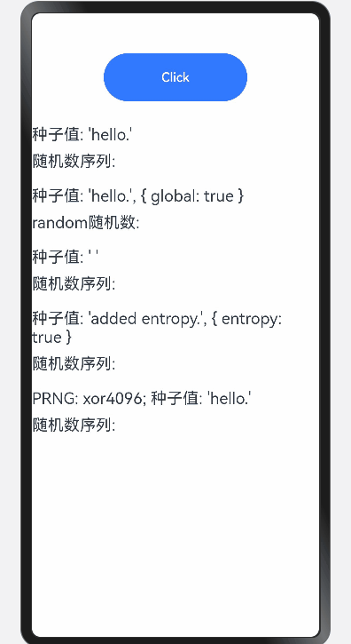

# seedrandom

## 简介

seedrandom是一个伪随机数生成器的库，适用于各种需要高质量伪随机数的应用场景，能够根据具体需求进行定制和优化。

## 效果展示


## 下载安装

````
ohpm install seedrandom@3.0.5
````

OpenHarmony ohpm 环境配置等更多内容，请参考[如何安装 OpenHarmony ohpm 包](https://gitee.com/openharmony-tpc/docs/blob/master/OpenHarmony_har_usage.md)

## 使用说明

```typescript
//引入seedrandom
import seedrandom from 'seedrandom'
//接口调用示例
rng = seedrandom('hello.');
console.log(rng());                  // Always 0.9282578795792454

// Global PRNG: set Math.random.
seedrandom('hello.', { global: true });
console.log(Math.random());          // Always 0.9282578795792454

// Autoseeded ARC4-based PRNG.
rng = seedrandom();
console.log(rng());                  // Reasonably unpredictable.

// Mixing accumulated entropy.
rng = seedrandom('added entropy.', { entropy: true });
console.log(rng());                  // As unpredictable as added entropy.

// Using alternate algorithms, as listed above.
rng2 = seedrandom.xor4096('hello.')
console.log(rng2());
```

## 接口说明

1. SeededRandom(seed, options)：创建一个新的 SeededRandom 实例，其中 seed 是种子值，options 是可选的配置对象。
2. seedrandom.alea(seed, options)：使用alea算法生成伪随机数。
3. seedrandom.xor128(seed, options)：使用xor128算法生成伪随机数。
4. seedrandom.tychei(seed, options)：使用tychei算法生成伪随机数。
5. seedrandom.xorwow(seed, options)：使用xorwow算法生成伪随机数。
6. seedrandom.xor4096(seed, options)：使用Xor4096算法生成伪随机数。
7. seedrandom.xorshift7(seed, options)：使用xorshift7算法生成伪随机数。
8. seedrandom.quick(seed, options)：使用quick算法生成伪随机数。


## 约束与限制

在下述版本验证通过：

- DevEco Studio 版本： 4.1 Canary(4.1.3.317), OpenHarmony SDK:API11 (4.1.0.36)

## 目录结构

````
|---- seedrandom 
|     |---- entry  # 示例代码文件夹
|     |---- README.md  # 安装使用方法      
````

## 贡献代码
使用过程中发现任何问题都可以提 [Issue](https://gitee.com/openharmony-tpc/openharmony_tpc_samples/issues) 给我们，当然，我们也非常欢迎你给我们发 [PR](https://gitee.com/openharmony-tpc/openharmony_tpc_samples/pulls) 。

## 开源协议
本项目基于 [MIT License](https://gitee.com/openharmony-tpc/openharmony_tpc_samples/blob/master/seedrandom/LICENSE) ，请自由地享受和参与开源。
