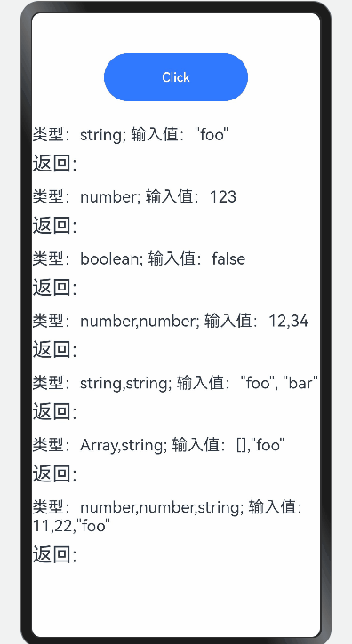

# typed-function

## 简介

typed-function支持以灵活、有组织的方式将类型检查逻辑和类型转换转移到函数之外。

## 效果展示


## 下载安装

````
ohpm install typed-function@4.1.0
````

OpenHarmony ohpm 环境配置等更多内容，请参考[如何安装 OpenHarmony ohpm 包](https://gitee.com/openharmony-tpc/docs/blob/master/OpenHarmony_har_usage.md)

## 使用说明

```typescript
//引入typed-function
import typed from 'typed-function'
//接口调用示例
let fn: ESObject = typed({
  string: (value: string) => {
    return 'string:' + value
  },
  number: (value: number) => {
    return 'number:' + value
  },
  boolean: (value: boolean) => {
    return 'boolean:' + value
  },
  'number,number': () => {
    return 'number,number'
  },
  'string,string': () => {
    return 'string,string'
  },
  'Array,string': () => {
    return 'Array,string'
  },
  'number,number,string': () => {
    return 'three'
  }
});
```

## 接口说明

1. 类型化函数构造: typed([name: string], ...Object.<string, function>|function)
2. 将值value转换为type类型: typed.convert(value: *, type: string)
3. 创建一个新的、独立的类型化函数实例: typed.create()
4. 解析一个类型化的函数，并返回一个可以执行的函数: typed.resolve(fn: typed-function, argList: Array)
5. 查找与给定函数签名匹配的类型化函数: typed.findSignature(fn: typed-function, signature: string | Array, options: object)
6. 在类型化函数中查找与给定签名匹配的函数: typed.find(fn: typed-function, signature: string | Array, options: object)
7. 创建类型化函数的引用: typed.referTo(...string, callback: (resolvedFunctions: ...function) => function)
8. 在类型化函数中创建对自身的引用: typed.referToSelf(callback: (self) => function)
9. 检查给定的实体是否是类型化函数: typed.isTypedFunction(entity: ESObject)
10. 向类型化函数库中添加自定义类型: typed.addType(type: {name: string, test: function, [, beforeObjectTest=true])
11. 清除类型化函数的类型定义: typed.clear()
12. 向类型化函数库中添加自定义类型转换: typed.addConversion(conversion: {from: string, to: string, convert: function})
13. 从类型化函数库中移除自定义类型转换: typed.removeConversion(conversion: ConversionDef)
14. 清除类型化函数的自定义类型转换: typed.clearConversions()

## 约束与限制

在下述版本验证通过：

- DevEco Studio 版本： 4.1 Canary(4.1.3.317), OpenHarmony SDK:API11 (4.1.0.36)

## 目录结构

````
|---- typed-function 
|     |---- entry  # 示例代码文件夹
|     |---- README.md  # 安装使用方法      
````

## 贡献代码
使用过程中发现任何问题都可以提 [Issue](https://gitee.com/openharmony-tpc/openharmony_tpc_samples/issues) 给我们，当然，我们也非常欢迎你给我们发 [PR](https://gitee.com/openharmony-tpc/openharmony_tpc_samples/pulls) 。

## 开源协议
本项目基于 [MIT License](https://gitee.com/openharmony-tpc/openharmony_tpc_samples/blob/master/typed-function/LICENSE) ，请自由地享受和参与开源。
