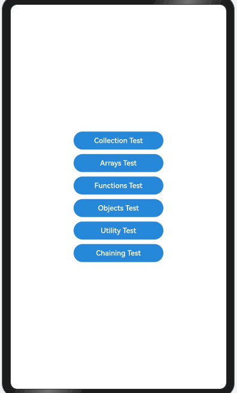

# Underscore

## 简介

Underscore是JavaScript的实用程序库，它在不扩展任何核心JavaScript对象的情况下，为常见的功能（each、map、reduce、filter…）提供支持。

## 效果展示


## 下载安装

````
ohpm install underscore@1.13.2
````

OpenHarmony ohpm 环境配置等更多内容，请参考[如何安装 OpenHarmony ohpm 包](https://gitee.com/openharmony-tpc/docs/blob/master/OpenHarmony_har_usage.md)

## 使用说明

```typescript
//引入underscore
import { first, last, union, indexOf, range } from 'underscore'
//接口调用示例
first([5, 4, 3, 2, 1]); //5
last([5, 4, 3, 2, 1]); //1
union([1, 2, 3], [101, 2, 1, 10], [2, 1]); //1,2,3,101,10
indexOf([1, 2, 3], 2); //1
range(10); //0,1,2,3,4,5,6,7,8,9
```
更多详细用法请参考开源库sample页面的实现

## 接口说明

1. 遍历数组、对象或集合: each(obj, iteratee, context)
2. 对集合中的每个元素执行一个提供的函数，并返回一个由该函数返回值构成的新集合: map(obj, iteratee, context)
3. 对集合中的元素进行归约操作: reduce(collection, iteratee, [initialValue])
4. 从集合中筛选出符合特定条件的元素，并返回一个新集合: filter(obj, predicate, context)
5. 创建一个链式调用序列: chain(obj)
6. 对集合中的每个对象调用一个方法: invoke(collection, methodName, [arguments])
7. 生成指定范围内的随机数: random(min, max)
8. 对字符串中的HTML字符进行转义: escape()
9. 获取当前时间的毫秒数: now()
10. 从集合中获取第一个元素: first(collection)
11. 从集合中获取最后一个元素: last(collection)
12. 从多个集合中返回唯一的元素，并返回一个新集合: union(array1, array2, ...)
13. 在集合中查找指定元素的索引位置: indexOf(array, value, [isSorted])
14. 生成一个数字序列: range([start], stop, [step])
15. 获取对象的所有键名（属性名）: keys(obj)
16. 获取对象的所有值: values(obj)
17. 将对象转换为包含键值对的数组: pairs(obj)
18. 将源对象的属性复制到目标对象中，并返回目标对象: extend(target, source1, source2, ...)
19. 创建对象的浅拷贝: clone(obj)

## 约束与限制

在下述版本验证通过：

- DevEco Studio 版本： 4.1 Canary(4.1.3.317), OpenHarmony SDK:API11 (4.1.0.36)

## 目录结构

````
|---- underscore 
|     |---- entry  # 示例代码文件夹
|     |---- README.md  # 安装使用方法      
````

## 贡献代码
使用过程中发现任何问题都可以提 [Issue](https://gitee.com/openharmony-tpc/openharmony_tpc_samples/issues) 给我们，当然，我们也非常欢迎你给我们发 [PR](https://gitee.com/openharmony-tpc/openharmony_tpc_samples/pulls) 。

## 开源协议
本项目基于 [MIT License](https://gitee.com/openharmony-tpc/openharmony_tpc_samples/blob/master/underscore/LICENSE) ，请自由地享受和参与开源。
