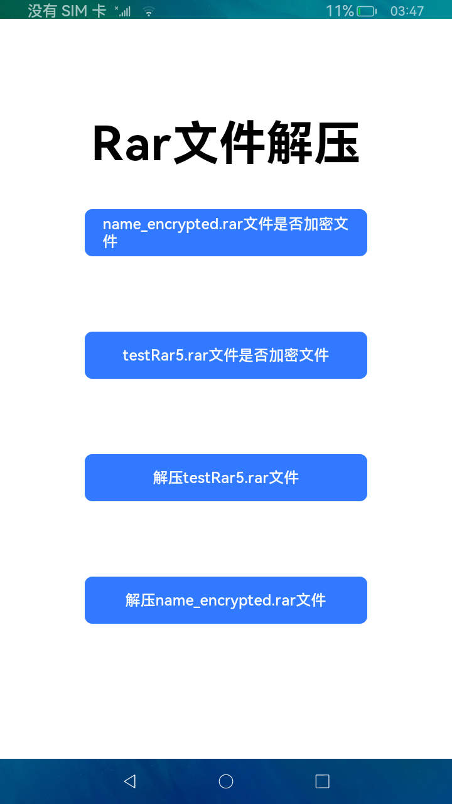

# Unrar

## 简介

[Unrar](https://www.rarlab.com/rar_add.htm) ，是一个解压rar文件的库。本库基于[Unrar](https://www.rarlab.com/rar_add.htm) 原库进行适配，使其可以运行在 OpenHarmony，并沿用其现有用法和特性。

- 判断压缩包名是否加密
- 解压文件到指定目标路径
- 解压无加密/加密压缩包



## 下载安装

```
ohpm install @ohos/unrar
```
- OpenHarmony ohpm 环境配置等更多内容，请参考[如何安装 OpenHarmony ohpm 包](https://gitee.com/openharmony-tpc/docs/blob/master/OpenHarmony_har_usage.md)

## 使用说明
```javascript
import unrar from '@ohos/unrar'
```


### isEncrypted 判断压缩包名是否加密方法示例

```
// path:文件所在路径 path目前只支持沙箱路径
unrar.isEncrypted(path)

```

### 解压无加密文件方法示例

```
unrar.RarFiles_Extract(path, globalThis.context.filesDir).then((value) => {
                let resultss;
                if (value == '解压成功') {
                  resultss = '解压testRar5.rar文件解压成功,解压文件在:' + globalThis.context.filesDir;
                } else {
                  resultss = value;
                }
                this.tag = true;
                this.showDialog(resultss)
              }).catch((error) => {
                this.tag = true;
                this.showDialog('解压失败')
              });

```

### 解压加密文件方法示例

```
unrar.RarFiles_Extract(path, globalThis.context.filesDir, passwords).then((value) => {
                  let resultss;
                  if (value == '解压成功') {
                    resultss = 'name_encrypted.rar文件解压成功,解压文件在:' + globalThis.context.filesDir;
                  } else {
                    resultss = '解压失败';
                  }
                  this.showDialog(resultss)
                }).catch((error) => {
                  this.showDialog('解压失败')
                });
```

## 约束与限制

在下述版本验证通过：

DevEco Studio: 4.0 (4.0.3.512), SDK: API10 (4.0.10.9)

DevEco Studio: 4.0 Canary1(4.0.0.112), SDK: API10 (4.0.7.2)

## 目录结构
```javascript
|---- ohosunrar
|     |---- entry  # 示例代码文件夹
|     |---- library  # unrar 库文件夹
|           |---- src   #  unrar库解压核心代码
|                 |---- cpp # unrar 核心代码
|     |---- README.MD  # 安装使用方法
```

## 贡献代码

使用过程中发现任何问题都可以提[Issue](https://gitee.com/openharmony-tpc/ohos-unrar/issues) 给我们，当然，我们也非常欢迎你给我们提[PR](https://gitee.com/openharmony-tpc/ohos-unrar/pulls)。

## 开源协议

本项目基于 [Apache License 2.0](https://gitee.com/openharmony-tpc/ohos-unrar/blob/master/LICENSE)，请自由地享受和参与开源。

